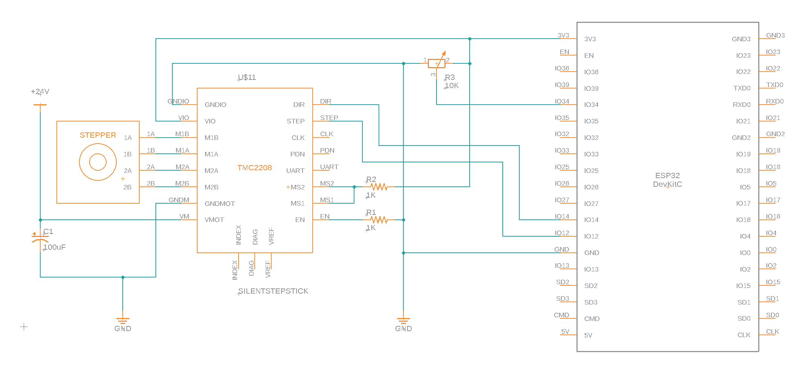

# Stepper Velocity

[Short video overview](https://twitter.com/Regorlas/status/1335428897928740867)

This ESP32 programming exercise uses the reading from a potentiometer to
control the rotational speed of a stepper motor. Position control is not
an objective here, thus the number of steps are not counted.

Default pin assignments can be changed in [`main.c`](src/main.c):
* STEP = GPIO12
* DIRECTION = GPIO14
* POTENTIOMETER = GPIO34

The DIRECTION signal is calculated after every potentiometer reading.

The STEP signal is generated by the LEDC PWM peripheral of ESP32. It is set to
50% duty cycle and the PWM frequency is changed after every potentiometer reading.
While the ESP32 is capable of a wide range of PWM frequencies, only a
constrained subset is available for a given LEDC timer configuration.

Change in rotational speed is kept within acceleration limits to prevent
jarring motion. If the potentiometer changes more than the limit between
loops,speed will smoothly accelerate/decelarate over several iterations.

This project directory structure was created with
[PlatformIO](https://platformio.org/)
with the
[ESP32 DevKit](https://docs.platformio.org/en/latest/boards/espressif32/esp32dev.html)
board profile on
[Espressif IoT Development Framework ESP-IDF](https://docs.platformio.org/en/latest/frameworks/espidf.html#framework-espidf).

This practice exercise used a
[Trinamic TMC2208 SilentStepStick](https://www.trinamic.com/support/eval-kits/details/silentstepstick/)
but the code should function equally well for any other stepper motor driver
module with STEP and DIRECTION input. (Note the ESP32 is a 3.3V device so
5V stepper control modules may need voltage level shifters.)

