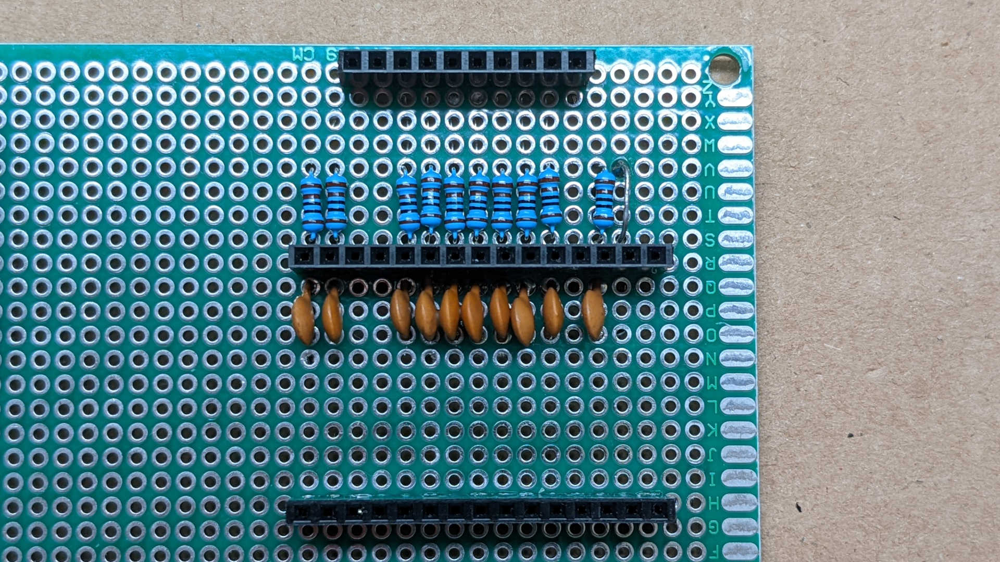
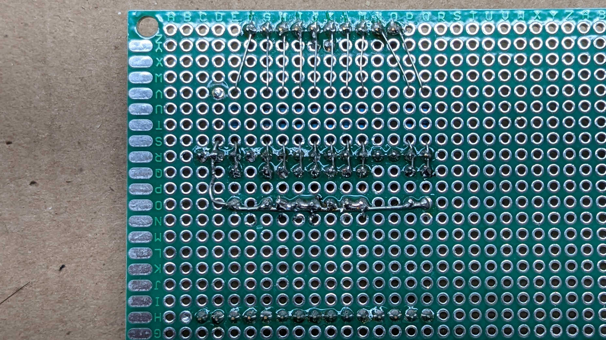
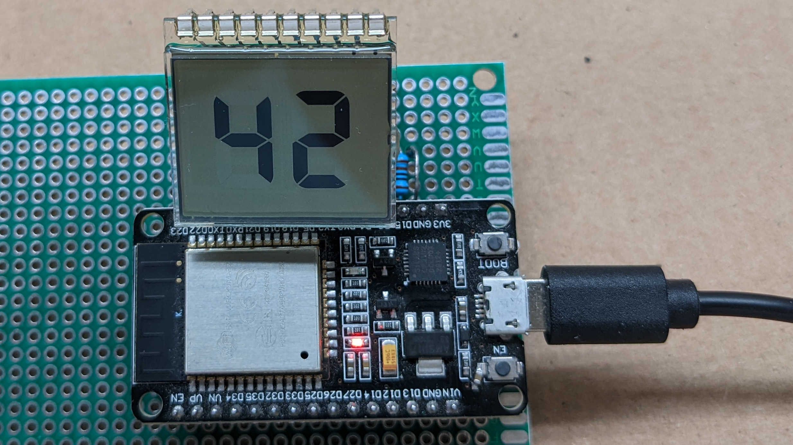

# Controller for bare LCD with two 7-segment digits

PlatformIO ESP-IDF project that directly drives a LCD salvaged from an
electric blanket controller, which has two digits of 7-segments each.
Multiplexed as 8 controllable segments with 2 common pins for a total
of 16 possible combinations, only 14 (2*7 segments) of which are used.

LEDC PWM handles generating the voltage levels required. 2.5MHz is the
maximum speed that still allows 32 levels of control, which translates
to roughly 0.1V (3.3V / 32) increments. A small capacitor (330pF used in the
prototype due to availability) is helpful to smooth out voltage level.

LCD segments are high impedance by nature but I added 1k Ohm resistors
to each line as a minor guard against accidental contact to exposed wires.

